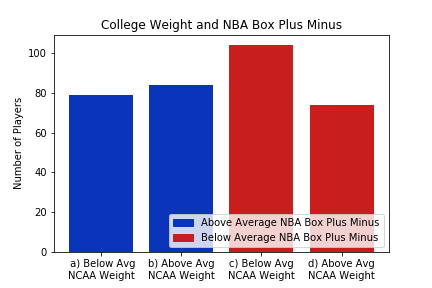
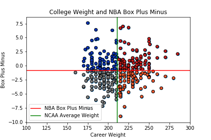

# Performance_Translation_Project

Our project aims to understand how weight, height, field goal percentage, and time spent in the NCAA ultimately translate over into the NBA.

The graph above demonstrates that as weight increases, so does the amount of rebounds a player will average in the NBA. Similarly, the projected number of blocks
that can be expected at higher weights increases. Although the count of stats appears to be lower than 1, the highest blocks per game in this given season was
recorded at 3.1 blocks by Hassan Whiteside. This means when taking the average of the other players, the value may be presented lower than 1. The other noticeable
trend is in the assist category. This could be because lighter players will end up as guards in the NBA, who tend to have higher percentages in these categories.

An interesting story when looking at statistics for weight: the lack of effect for box plus minus. As seen above, there is no noticeable difference with a higher than
average NBA box plus minus player and his college weight. This bar plot categorizes players into above/below average weight, and above/below average NBA plus
minus. Plus minus means when the player is in the game, the difference in score is the metric, meaning a +3 for a player equates to when the player is in the game, the
team ended up being up by 3. So, this plot tells us that weight is not a good metric for determining performances other than rebounding, as seen by the left 2 bars
having a similar value. This might be because an NBA players weight can fluctuate, meaning a weight in college doesn’t make or break a player in the NBA. A player can
lose weight as easily as they can gain it with proper workout and nutrition.

A similar story can be generated for a player’s height in college. As height increases, the general trend is that rebounds increase. As mentioned previously, blocks also
exhibit an increasing trend, even though the count of stats is reflected as 1. With respect to assists, as the players’ height increases, the count of stats exhibits a
decline in this category. Finally, the other two categories (steals and turnovers), don’t seem to have a general trend because their values stay rather consistent
across the board.

An interesting story we found when comparing averages of college players' height came when we compared heights to the same Box Plus Minus data we compared to
weight. This time, we saw a much different trend, specifically when it came to players above the average NBA plus minus. There now is a larger difference in
players who were above average in height compared to those below average in height. This tells us that when looking at height vs weight for impact on the game,
having an above average height seems to translate into better performance in the NBA than weight. This is not a hard conclusion, just something an NBA GM might
consider for upside. Overall, it seems that height can give a better look at how successful an NBA player will be from college compared to weight, only because we
have data that supports a difference when it comes to college players height compared to weight.

Looking at the overall box score statistics of the binned shooting percentages, it seems that there is a trend in PER and higher shooting percentage. There are some
outliers, namely in the first two ranges, but after that the PER (player efficiency rating) of a player increases as field goal percentage increases. This is the same for
offensive win shares, meaning that the offensive plays of these player contribute more to wins for their team. The only stat that doesn’t vary is points per game
(PPG). An explanation for this could be that role players who shoots high percentage shots such as 3-point specialists and rim-running centers have a specific role in the
NBA, and thus don’t have the ball much in their hands, or don’t need the ball in their hands too long to shoot effectively.

 As for a specific story to tell with this data, we noticed how players tend to carry over their field goal percentage from college or get better. This comparison above is
between college player’s field goal percentage and NBA field goal percentage. As seen with the bar graph, an above average NBA FG%, in blue, will have more players
in this category than those with above average percentages in college. However, the most interesting part about this graph is the far-right bar, with players with an
above average field goal percentage in college, and below average percentage in the NBA. There is the least number of players in this category, making the data trend
towards the idea that field goal percentages will either stay similar or get better, more likely than to get worse. This can provide a peace of mind for NBA GMs as a 3-
point sharpshooter in college will probably succeed in the NBA, or if a player needs to work on his shot, it’s not unheard of to progress significantly.

Unfortunately, the data that we were working with showed that games played varies from player to player instead of giving a definitive year played. (this is taking into
consideration that some players play longer due to being active in tournaments). However, as seen with the scatter plot above, there is a natural divide between 1st,
2nd, 3rd, and 4th year players. And the first plot compares it to win shares, where above average NBA win shares are found mostly with players at 2 years or below in
college. The largest bar is with below average NBA players spending above average time in college. That doesn’t bode well for the idea that staying in college can help a
prospect hone their game.

Finally, the last plot the team did was about time spent in college and how it translates to PER, or player efficiency rating. This was most telling about how time
spent in college affects player performance, as clearly there is a divide between extremes. The number of players with below average time spent in college have
significantly higher PER’s than those who stayed, and those who stayed above the average time spent in college have significantly more below average PER’s. This can
provide some proof that players who leave college early, are usually more prepared and naturally talented than those who need to stay in college and develop at the
collegiate level. And on the other side, we can hypothesize that players who develop outside of college longer, meaning with professional trainers, paid nutritionists, and
team doctors, probably develop better than players who spend their youth developing in college environments, where equipment and personnel aren’t quite as professional.
